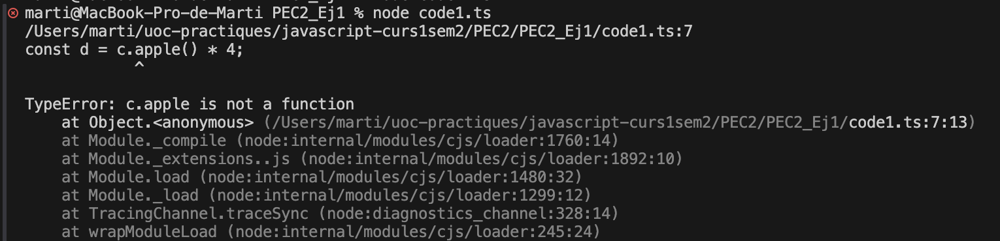

code1.ts:

L'error que es mostra a la imatge seguent es deu a que 'a' és un number pero s'executa com si fos una funció.

-------------------------------------
Preguntes:

1. (1 punt) Per a cadascun dels valors del fitxer code2.ts, quin tipus de dades
inferirà TypeScript? Expliqueu per què s'ha inferit aquest tipus de dades.
a: Inferirà en unn number
b: Inferirà en un string o millor dit single quoted string.
c: Inferirà en un scring, igual que el punt b.
d: Inferirà com un array de booleans.
e: Inferirà com un objecte que contè un string al valor type.
f: Inferirà amb un array que contè diversos tipos, un number i un booleà.
g: Inferirà com un array que conte un number.

2. (1 punt) Per què es dispara cadascun dels errors del fitxer code3.ts?
1: Aquets error indica que al "i" ser una constant no se li pot tornar a assignar un valor.
2: Aquest error indica que al ser "j" un array de numeros no se li pot introduir un valor '5' ja que no es de tipo number.
3: Aquest error indica que no es pot assignar 4 a "never" ja que es una variable reservada per typescript.
4: Aquest error indica que com que "l" és unknown no es poden fer operacions directes sobre "l".

3. (0,5 punts) Quina és la diferència entre una classe i una interfície a TypeScript?
- La principal diferencia és que en una interfície nomes es defineix l'estructura que te un objecte, en canvi, a una classe a part de definir l'estructura també permet incloure-hi mètodes, funcions, constructors, etc.

